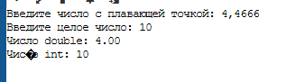

**Дисциплина:** _Программирование. Язык СИ_

 **Преподаватели:** _Власов Дмитрий Викторович, Мельников Федор Владиславович_
 
 **Учебное заведение:** _РГПУ им. А. И. Герцена_
 
# Лабораторная работа №4  
## Тема: Введение в функции. Базовая работа со строками (однобайтовыми). 

**Автор:** Иванова А.Д., группа ИВТ-1.2  

---

## Комплект 1: Введение в функции

### Задание 1.1
**Создайте две функции, которые вычисляют факториал числа:**
- Функция с использованием цикла.
- Рекурсивная функция.

#### Математическая модель:

$$ n! = \prod_{i=1}^{n} i $$

#### Список идентификаторов:
| Имя | Тип | Назначение |
| --- | --- | --- |
| `factorial_loop` | `unsigned long long` | Вычисляет факториал с помощью цикла |
| `factorial_recursive` | `unsigned long long` | Вычисляет факториал рекурсивно |
| `n` | `int` | Число, для которого вычисляется факториал |

#### Код программы:
```c
#include <stdio.h>

// Функция вычисления факториала с использованием цикла
unsigned long long factorial_loop(int n) {
    unsigned long long result = 1;
    for (int i = 1; i <= n; i++) {
        result *= i;
    }
    return result;
}

// Рекурсивная функция вычисления факториала
unsigned long long factorial_recursive(int n) {
    if (n == 0 || n == 1) {
        return 1;
    }
    return n * factorial_recursive(n - 1);
}

int main() {
    int n;
    printf("введите число для вычисления факториала: ");
    scanf("%d", &n);

    printf("факториал (цикл): %llu\n", factorial_loop(n));
    printf("факториал (рекурсия): %llu\n", factorial_recursive(n));

    return 0;
}
```

#### Результаты выполненной работы:


---

### Задание 1.2
Объявите указатель на массив типа `int` и динамически выделите память для 12 элементов. Напишите функцию, которая поменяет значения чётных и нечётных ячеек массива.

#### Список идентификаторов:
| Имя | Тип | Назначение |
| --- | --- | --- |
| `arr` | `int*` | Указатель на массив |
| `size` | `int` | Размер массива |
| `swap_even_odd` | `void` | Функция для обмена четных и нечетных элементов |

#### Код программы:
```c
#include <stdio.h>
#include <stdlib.h>

// Функция для обмена четных и нечетных элементов
void swap_even_odd(int* arr, int size) {
    for (int i = 0; i < size - 1; i += 2) {
        int temp = arr[i];
        arr[i] = arr[i + 1];
        arr[i + 1] = temp;
    }
}

int main() {
    int size = 12;
    int* arr = (int*)malloc(size * sizeof(int));

    for (int i = 0; i < size; i++) {
        arr[i] = i + 1;
    }

    printf("исходный массив:\n");
    for (int i = 0; i < size; i++) {
        printf("%d ", arr[i]);
    }
    printf("\n");

    swap_even_odd(arr, size);

    printf("массив после обмена:\n");
    for (int i = 0; i < size; i++) {
        printf("%d ", arr[i]);
    }
    printf("\n");

    free(arr); 

    return 0;
}
```

#### Результаты выполненной работы:


---

### Задание 1.3
**Создать две основные функции:**
- Функция для динамического выделения памяти под двумерный массив типа `double`  — матрицу.
- Функция для динамического освобождения памяти под двумерный массив типа `double`  — матрицу.

**Вспомогательные функции:**
- Для заполнения матрицы.
- Для распечатки матрицы.


#### Список идентификаторов:
| Имя | Тип | Назначение |
| --- | --- | --- |
| `create_matrix` | `double**` | Создает двумерную матрицу |
| `free_matrix` | `void` | Освобождает память матрицы |
| `fill_matrix` | `void` | Заполняет матрицу случайными числами |
| `print_matrix` | `void` | Печатает матрицу на экране |

#### Код программы: 
```c
#include <stdio.h>
#include <stdlib.h>
#include <time.h>

#define ROWS 3
#define COLS 4

// Функция создания матрицы
double** create_matrix(int rows, int cols) {
    double** matrix = (double**)malloc(rows * sizeof(double*));
    for (int i = 0; i < rows; i++) {
        matrix[i] = (double*)malloc(cols * sizeof(double));
    }
    return matrix;
}

void free_matrix(double** matrix, int rows) {
    for (int i = 0; i < rows; i++) {
        free(matrix[i]);
    }
    free(matrix);
}

void fill_matrix(double** matrix, int rows, int cols) {
    srand(time(NULL));
    for (int i = 0; i < rows; i++) {
        for (int j = 0; j < cols; j++) {
            matrix[i][j] = (double)(rand() % 100) / 10.0;
        }
    }
}

// Функция вывода матрицы 
void print_matrix(double** matrix, int rows, int cols) {
    for (int i = 0; i < rows; i++) {
        for (int j = 0; j < cols; j++) {
            printf("%.1f\t", matrix[i][j]);
        }
        printf("\n");
    }
}

int main() {
    double** matrix = create_matrix(ROWS, COLS);
    fill_matrix(matrix, ROWS, COLS);

    printf("матрица:\n");
    print_matrix(matrix, ROWS, COLS);

    free_matrix(matrix, ROWS);

    return 0;
}
```

#### Результаты выполненной работы:


---

### Задание 1.4
Создать функцию, которая вычисляет векторное произведение двух векторов в декартовых координатах, используя указатели на соответствующие массивы.

#### Математическая модель:
Векторное произведение двух трёхмерных векторов $\vec{a} = (a_x, a_y, a_z)$ и $\vec{b} = (b_x, b_y, b_z)$ определяется по формуле:

$$
\vec{c} = \vec{a} \times \vec{b} = 
\begin{vmatrix}
\mathbf{i} & \mathbf{j} & \mathbf{k} \\
a_x & a_y & a_z \\
b_x & b_y & b_z \\
\end{vmatrix}
= (a_y b_z - a_z b_y,\; a_z b_x - a_x b_z,\; a_x b_y - a_y b_x)
$$

где:
- $\vec{c} = (c_x, c_y, c_z)$ — результирующий вектор,
- $c_x = a_y b_z - a_z b_y$,
- $c_y = a_z b_x - a_x b_z$,
- $c_z = a_x b_y - a_y b_x$.

#### Список идентификаторов:
| Имя | Тип | Назначение |
| --- | --- | --- |
| `vector_product` | `void` | Вычисляет векторное произведение |
| `a[3]`, `b[3]` | `double[]` | Входные векторы |
| `result[3]` | `double[]` | Результат |

#### Код программы:
```c
#include <stdio.h>

// Функция для вычисления векторного произведения
void vector_product(double* a, double* b, double* result) {
    result[0] = a[1] * b[2] - a[2] * b[1];
    result[1] = a[2] * b[0] - a[0] * b[2];
    result[2] = a[0] * b[1] - a[1] * b[0];
}

int main() {
    double a[3] = {1.0, 2.0, 3.0};
    double b[3] = {4.0, 5.0, 6.0};
    double result[3];

    vector_product(a, b, result);

    printf("векторное произведение: (%.2f, %.2f, %.2f)\n", result[0], result[1], result[2]);

    return 0;
}
```

#### Результаты выполненной работы:


---

## Комплект 2: Базовые операции со строками

### Задание 2.1
Создайте новую программу, где с клавиатуры вводится строка некоторой длины порядка 10 латинских символов
(не используйте кириллицу) в классическую строку языка C, которая имеет вид массива ```char my_string[MY_SIZE]```.
`MY_SIZE` определите с помощью директивы ```#define```. 
Значение ```MY_SIZE``` должно превышать длину вводимой строки с некоторым разумным запасом. 
Другие строки в этой задаче можете создавать либо также как статические массивы, либо как динамические массивы, но не забывайте освобождать от динамически выделенную память с помощью функции ```void free(void∗ ptr);``` .

**Выполните следующие действия и распечатайте результаты:**

 **1.** Вычислите длину строки `my_string`, используя цикл `for` и тот
 факт, что в языке C такие строки имеют в конце специальный нулевой символ конца строки, представленный escape-последовательностью
 '\0' ('...' — это тип `char`).
 
 **2.** Сделайте тоже самое, что в пункте 1, но создайте указатель на
 начало вашей строки и используйте операцию инкремента ++.
 
 **3.** Используйте функции `size_t strlen(const char∗ str);` или
`size_t strnlen (const char ∗string, size_t maxlen);` или
 `size_t strnlen_s(const char ∗str, size_t strsz);` для получения размера строки в виде значения `size_t` (псевдоним
 `unsigned int`, спецификатор форматирования —"%zu"). Убедитесь, что ваш компилятор явно работает с опцией-std=c11 или с
 опцией для более позднего стандарта языка для поддержки функции `strnlen_s`.
 
 **4.** Создайте вторую строку (второй массив) и скопируйте в неё строку `my_string`, используя функцию
 `char ∗strcpy(char ∗dest, const char ∗src);` или
 `char ∗strncpy (char ∗dest, const char ∗src, size_t n);`.
 
 **5.** Создайте ещё две строки какого-либо размера и задайте их прямо
 в коде без клавиатуры. Сделайте конкатенацию этих двух строк,
 используя `char ∗strcat(char ∗dest, const char ∗src);` или
 `char ∗strncat(char ∗dest, const char ∗src, size_t n);`.
 Первую строку трактуйте как `dest (destination)` и подберите размер этого массива с запасом.
 
**6.** Сравните две новые строки, заданные в коде строковыми литералами, используя функцию
 `int strcmp(const char ∗lhs, const char ∗rhs);` или
 `int strncmp (const char ∗s1, const char ∗s2, size_t n)`.
 
 **7.** Задайте прямо в коде строку, в которой есть только латинские
символы в верхнем и нижнем регистре. Переведите строку полностью в нижний регистр и отдельно полностью в верхний регистр.
Распечатайте каждый результат отдельно. Найдите сигнатуры подходящих функций `(tolower и toupper)`.

#### Список идентификаторов:
| Имя | Тип | Назначение |
| --- | --- | --- |
| `my_string` | `char[]` | Исходная строка |
| `str_len` | `size_t` | Длина строки |
| `strcpy`, `strncpy` | `char*` | Копирование строк |
| `strcat`, `strncat` | `char*` | Конкатенация строк |
| `strcmp`, `strncmp` | `int` | Сравнение строк |
| `tolower`, `toupper` | `int` | Изменение регистра |

#### Код программы: 
```c
#include <stdio.h>
#include <string.h>
#include <ctype.h>

int main() {
    #define MY_SIZE 100
    char my_string[MY_SIZE];

    printf("введите строку: ");
    fgets(my_string, MY_SIZE, stdin);
    my_string[strcspn(my_string, "\n")] = '\0'; 

    // Вычисление длины строки через цикл
    int length = 0;
    for (int i = 0; my_string[i] != '\0'; i++) {
        length++;
    }
    printf("длина строки (цикл): %d\n", length);

    // Вычисление длины строки через указатель
    char* ptr = my_string;
    while (*ptr != '\0') {
        ptr++;
    }
    printf("длина строки (указатель): %ld\n", ptr - my_string);

    // Использование strlen
    printf("длина строки (strlen): %zu\n", strlen(my_string));

    // Копирование строки
    char copy_str[MY_SIZE];
    strcpy(copy_str, my_string);
    printf("скопированная строка: %s\n", copy_str);

    // Конкатенация
    char str1[MY_SIZE] = "Hello";
    char str2[] = " World!";
    strcat(str1, str2);
    printf("конкатенация: %s\n", str1);

    // Сравнение
    char cmp1[] = "abc";
    char cmp2[] = "abd";
    int cmp_result = strcmp(cmp1, cmp2);
    if (cmp_result == 0) printf("строки равны\n");
    else if (cmp_result < 0) printf("первая строка меньше\n");
    else printf("первая строка больше\n");

    // Изменение регистра
    char upper_str[MY_SIZE], lower_str[MY_SIZE];
    for (int i = 0; my_string[i]; i++) {
        upper_str[i] = toupper(my_string[i]);
        lower_str[i] = tolower(my_string[i]);
    }
    upper_str[length] = '\0';
    lower_str[length] = '\0';

    printf("в верхнем регистре: %s\n", upper_str);
    printf("в нижнем регистре: %s\n", lower_str);

    return 0;
}
```

#### Результаты выполненной работы:


---

### Задание 2.2
Конвертируйте введённые заданные как строки: 
число с плавающей точкой `double` и целое число `int` в значения типа `double` и `int`, используя функциями `atof` и `atoi`.

#### Список идентификаторов:
| Имя | Тип | Назначение |
| --- | --- | --- |
| `str_double` | `char[]` | Строка для `double` |
| `str_int` | `char[]` | Строка для `int` |
| `num_double` | `double` | Преобразованное значение `double` |
| `num_int` | `int` | Преобразованное значение `int` |

#### Код программы:
```c
#include <stdio.h>
#include <stdlib.h>

int main() {
    char str_double[100], str_int[100];

    printf("введите число с плавающей точкой: ");
    fgets(str_double, 100, stdin);
    str_double[strcspn(str_double, "\n")] = '\0';

    printf("введите целое число: ");
    fgets(str_int, 100, stdin);
    str_int[strcspn(str_int, "\n")] = '\0';

    double num_double = atof(str_double);
    int num_int = atoi(str_int);

    printf("число double: %.2f\n", num_double);
    printf("число int: %d\n", num_int);

    return 0;
}
```

#### Результаты выполненной работы:



---

### Задание 2.3
Создайте строку от 10 до 20 символов, используя только цифры, латинский буквы в разных регистрах пробельные символы и символы
пунктуации. Организуйте цикл, где каждый символ подробно тестируется функциями типа int `is∗(/∗... ∗/)`.

#### Список идентификаторов:
| Имя | Тип | Назначение |
| --- | --- | --- |
| `input` | `char[]` | Входная строка |
| `i` | `int` | Индекс символа |
| `ch` | `char` | Текущий символ |
| `isdigit`, `isalpha`, `ispunct`, `isspace` | `int` | Проверка символов |

#### Код программы: 
```c
#include <stdio.h>
#include <ctype.h>
#include <string.h>

int main() {
    char input[100];

    printf("введите строку (от 10 до 20 символов): ");
    fgets(input, sizeof(input), stdin);
    input[strcspn(input, "\n")] = '\0'; 

    int len = strlen(input);

    if (len < 10 || len > 20) {
        printf("ошибка: длина строки должна быть от 10 до 20 символов.\n");
        return 1;
    }

    printf("анализ символов:\n");
    for (int i = 0; input[i] != '\0'; i++) {
        char ch = input[i];
        printf("символ '%c': ", ch);
        if (isdigit(ch)) printf("цифра ");
        if (isalpha(ch)) printf("буква ");
        if (ispunct(ch)) printf("пунктуация ");
        if (isspace(ch)) printf("пробельный символ ");
        printf("\n");
    }

    return 0;
}
```

#### Результаты выполненной работы:


---
