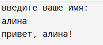
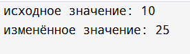
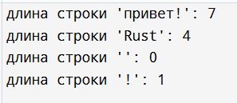
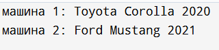
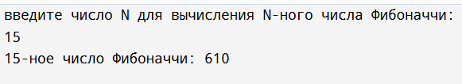
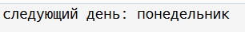
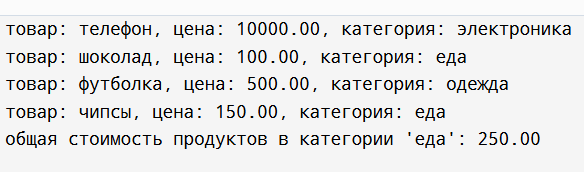
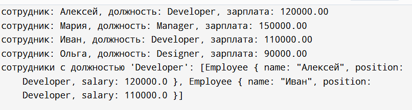

**Дисциплина:** _Программирование. Язык СИ_

 **Преподаватели:** _Власов Дмитрий Викторович, Мельников Федор Владиславович_
 
 **Учебное заведение:** _РГПУ им. А. И. Герцена_
 
# Лабораторная работа №6  
## Тема: Введение в Rust.

**Автор:** Иванова А.Д., группа ИВТ-1.2  

---

## Задание 1  
Напишите программу, которая запрашивает у пользователя имя и выводит на экран приветственное сообщение с использованием этого имени.

### Список идентификаторов:

| Имя   | Тип         | Смысл                                      |
|-------|-------------|--------------------------------------------|
| name  | String      | Переменная для хранения введённого имени   |
| main  | функция     | Точка входа в программу                    |
| io    | модуль      | Модуль стандартной библиотеки для ввода/вывода |
| stdin | функция     | Получает ссылку на стандартный поток ввода |
| read_line | метод   | Считывает строку из ввода                  |
| expect | метод      | Обрабатывает возможную ошибку               |
| trim  | метод       | Удаляет лишние пробелы по краям строки      |

### Код программы:
```rust
use std::io;

fn main() {
    println!("введите ваше имя:");

    let mut name = String::new();
    io::stdin().read_line(&mut name)
        .expect("не удалось прочитать строку");

    let name = name.trim(); // Убираем лишние пробелы и символы перевода строки
    println!("привет, {}!", name);
}
```
### Результат выполненной работы:


--- 
## Задание 2  
Создайте переменную типа целое беззнаковое число и выведите ее значение на экран. Явно укажите тип переменной. Затем измените значение переменной и снова выведите его.

### Список идентификаторов:

| Имя  | Тип   | Смысл                             |
|------|-------|----------------------------------|
| num  | u32   | Беззнаковая целочисленная переменная |

### Код программы:
```rust
fn main() {
    let mut num: u32 = 10;
    println!("исходное значение: {}", num);
    num = 25;
    println!("изменённое значение: {}", num);
}
```
### Результат выполненной работы:


---

## Задание 3  
Напишите функцию, которая принимает строку и возвращает её длину (количество символов). Затем вызовите эту функцию с различными строками.

### Список идентификаторов:

| Имя        | Тип     | Смысл                              |
|------------|---------|-----------------------------------|
| get_length | функция | Возвращает длину строки           |
| s          | &str    | Параметр — ссылка на входную строку |
| str1       | String  | Первая тестовая строка            |
| str2       | String  | Вторая тестовая строка            |

### Код программы:
```rust
fn main() {
    let test_strings = [
        "привет!",
        "Rust",
        "",
        "!", 
    ];

    // Вызываем функцию для каждой строки
    for s in test_strings {
        let length = string_length(s);
        println!("длина строки '{}': {}", s, length);
    }
}

fn string_length(s: &str) -> usize {
    s.chars().count()
}
```
### Результат выполненной работы:


---

## Задание 4  
Задайте структуру `Car` с полями `brand`, `model` и `year`, и создайте несколько экземпляров этой структуры. Выведите информацию о каждой машине на экран.

### Список идентификаторов:

| Имя    | Тип     | Смысл                        |
|--------|---------|-----------------------------|
| Car    | struct  | Структура, представляющая автомобиль |
| brand  | String  | Марка авто   |
| model  | String  | Модель авто  |
| year   | u32     | Год выпуска  |
| car1   | Car     | Экземпляр автомобиля         |
| car2   | Car     | Другой экземпляр автомобиля  |

### Код программы:
```rust
fn main() {
    struct Car {
        brand: String,
        model: String,
        year: u32,
    }

    let car1 = Car {
        brand: String::from("Toyota"),
        model: String::from("Corolla"),
        year: 2020,
    };
    let car2 = Car {
        brand: String::from("Ford"),
        model: String::from("Mustang"),
        year: 2021,
    };

    println!("машина 1: {} {} {}", car1.brand, car1.model, car1.year);
    println!("машина 2: {} {} {}", car2.brand, car2.model, car2.year);
}
```
### Результат выполненной работы:


---

## Задание 5  
Напишите программу, которая запрашивает у пользователя число N и выводит на экран N-ное число Фибоначчи. Используйте рекурсию для решения этой задачи.

### Список идентификаторов:

| Имя      | Тип     | Смысл                                  |
|----------|---------|---------------------------------------|
| fibonacci| функция | Рекурсивная функция вычисления числа Фибоначчи |
| n        | u32     | Номер числа Фибоначчи                  |
| input    | String  | Строка для хранения пользовательского ввода |

### Код программы:
```rust
use std::io;

// Рекурсивная функция для вычисления N-ного числа Фибоначчи
fn fibonacci(n: u32) -> u64 {
    match n {
        0 => 0,
        1 => 1,
        _ => fibonacci(n - 1) + fibonacci(n - 2),
    }
}

fn main() {
    println!("введите число N для вычисления N-ного числа Фибоначчи:");

    let mut input = String::new();
    io::stdin()
        .read_line(&mut input)
        .expect("ошибка при чтении строки");

    let n: u32 = input.trim().parse().expect("Введите целое число!");

    let result = fibonacci(n);
    println!("{}-ное число Фибоначчи: {}", n, result);
}
```
### Результат выполненной работы:


---

## Задание 6  
Реализуйте перечисление `DayOfWeek` для дней недели. Напишите функцию, которая принимает день недели и возвращает следующий день. Обработайте случаи перехода на следующий день недели, если текущий день – воскресенье.

### Список идентификаторов:

| Имя        | Тип     | Смысл                                |
|------------|---------|-------------------------------------|
| DayOfWeek  | enum    | Перечисление дней недели             |
| next_day   | функция | Возвращает следующий день недели     |
| today      | DayOfWeek | Текущий день недели                 |
| tomorrow   | DayOfWeek | Следующий день недели               |

### Код программы:
```rust
fn main() {
    #[derive(Debug, Clone, Copy, PartialEq)]
    enum DayOfWeek {
        Monday,
        Tuesday,
        Wednesday,
        Thursday,
        Friday,
        Saturday,
        Sunday,
    }

    fn next_day(day: DayOfWeek) -> DayOfWeek {
        match day {
            DayOfWeek::Monday => DayOfWeek::Tuesday,
            DayOfWeek::Tuesday => DayOfWeek::Wednesday,
            DayOfWeek::Wednesday => DayOfWeek::Thursday,
            DayOfWeek::Thursday => DayOfWeek::Friday,
            DayOfWeek::Friday => DayOfWeek::Saturday,
            DayOfWeek::Saturday => DayOfWeek::Sunday,
            DayOfWeek::Sunday => DayOfWeek::Monday,
        }
    }

    let today = DayOfWeek::Sunday;
    let tomorrow = next_day(today);

    match tomorrow {
        DayOfWeek::Monday => println!("следующий день: понедельник"),
        DayOfWeek::Tuesday => println!("следующий день: вторник"),
        DayOfWeek::Wednesday => println!("следующий день: среда"),
        DayOfWeek::Thursday => println!("следующий день: четверг"),
        DayOfWeek::Friday => println!("следующий день: пятница"),
        DayOfWeek::Saturday => println!("следующий день: суббота"),
        DayOfWeek::Sunday => println!("следующий день: воскресенье"),
    }
}
```
### Результат выполненной работы:


---

## Задание 7  
Создайте структуру `Product` с полями `name`, `price` и `category`, а также перечисление `Category` для категорий товаров. 
Напишите метод для вывода информации о продукте и ассоциированную функцию для подсчета общей суммы товаров в заданной категории из массива продуктов.

### Список идентификаторов:

| Имя              | Тип     | Смысл                                      |
|------------------|---------|-------------------------------------------|
| Category         | enum    | Категории товаров                         |
| Product          | struct  | Товар с полями name, price, category      |
| name             | String  | Название товара                            |
| price            | f64     | Цена товара                                |
| category         | Category| Категория товара                           |
| print_info       | метод   | Метод вывода информации о товаре           |
| total_in_category| функция | Сумма цен товаров в указанной категории   |
| products         | Vec<Product> | Вектор товаров для тестирования    |

### Код программы:
```rust
fn main() {
    #[derive(Debug, Clone, PartialEq)]
    enum Category {
        Electronics,
        Food,
        Clothing,
    }

    struct Product {
        name: String,
        price: f64,
        category: Category,
    }

    impl Product {
        fn print_info(&self) {
            let cat_str = match self.category {
                Category::Electronics => "электроника",
                Category::Food => "еда",
                Category::Clothing => "одежда",
            };
            println!("товар: {}, цена: {:.2}, категория: {}", self.name, self.price, cat_str);
        }

        fn total_in_category(products: &[Product], category: Category) -> f64 {
            products.iter().filter(|p| p.category == category).map(|p| p.price).sum()
        }
    }

    let products = vec![
        Product { name: String::from("телефон"), price: 10000.0, category: Category::Electronics },
        Product { name: String::from("шоколад"), price: 100.0, category: Category::Food },
        Product { name: String::from("футболка"), price: 500.0, category: Category::Clothing },
        Product { name: String::from("чипсы"), price: 150.0, category: Category::Food },
    ];

    for product in &products {
        product.print_info();
    }

    let food_total = Product::total_in_category(&products, Category::Food);
    println!("общая стоимость продуктов в категории 'еда': {:.2}", food_total);
}
```
### Результат выполненной работы:


---

## Задание 8  
Создайте структуру `Employee` с полями `name`, `position`, `salary`, а также перечисление `Position` для должностей сотрудников. 
Напишите функцию, которая принимает вектор сотрудников и возвращает вектор сотрудников заданной должности.

### Список идентификаторов:

| Имя              | Тип     | Смысл                                       |
|------------------|---------|--------------------------------------------|
| Position         | enum    | Перечисление должностей                    |
| Employee         | struct  | Сотрудник с полями name, position, salary  |
| name             | String  | Имя сотрудника                             |
| position         | Position| Должность сотрудника                       |
| salary           | f64     | Зарплата сотрудника                        |
| filter_by_position| функция| Фильтрует сотрудников по должности        |
| employees        | Vec<Employee>| Вектор сотрудников для тестирования |
| developers       | Vec<Employee>| Отфильтрованный список разработчиков |

### Код программы:
```rust
fn main() {
    #[derive(Debug, Clone, PartialEq)]
    enum Position {
        Manager,
        Developer,
        Designer,
    }

    #[derive(Debug)]
    struct Employee {
        name: String,
        position: Position,
        salary: f64,
    }

    impl Employee {
        fn print_info(&self) {
            println!(
                "сотрудник: {}, должность: {:?}, зарплата: {:.2}",
                self.name, self.position, self.salary
            );
        }
    }

    fn filter_by_position(employees: Vec<Employee>, target: Position) -> Vec<Employee> {
        employees.into_iter().filter(|e| e.position == target).collect()
    }

    let employees = vec![
        Employee { name: String::from("Алексей"), position: Position::Developer, salary: 120000.0 },
        Employee { name: String::from("Мария"), position: Position::Manager, salary: 150000.0 },
        Employee { name: String::from("Иван"), position: Position::Developer, salary: 110000.0 },
        Employee { name: String::from("Ольга"), position: Position::Designer, salary: 90000.0 },
    ];

    for employee in &employees {
        employee.print_info();
    }

    let developers = filter_by_position(employees, Position::Developer);
    println!("сотрудники с должностью 'Developer': {:?}", developers);
}
```
### Результат выполненной работы:


---
